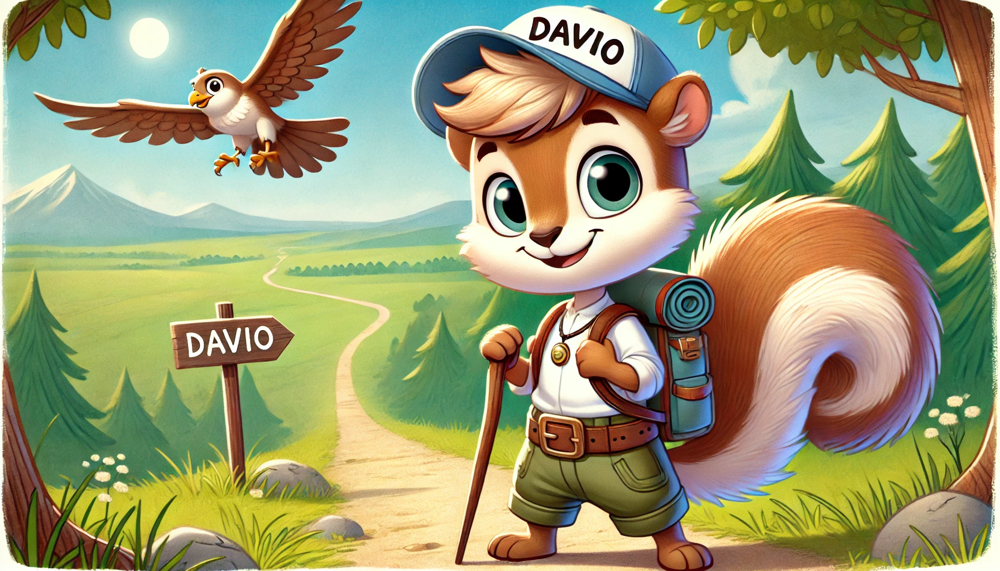
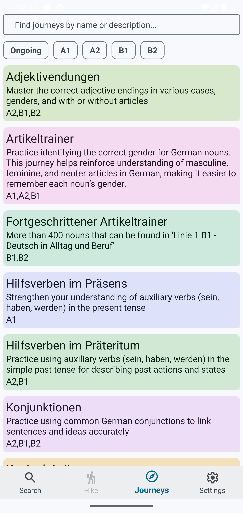
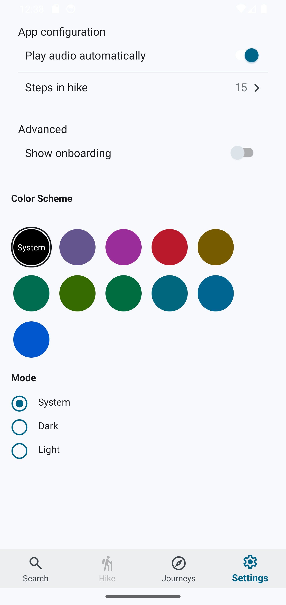
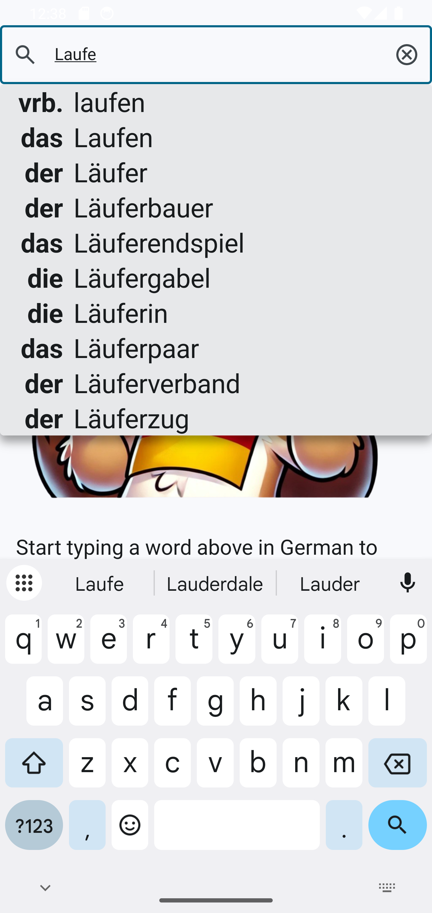
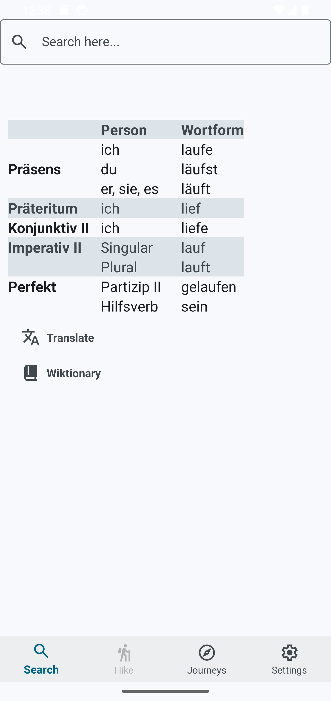
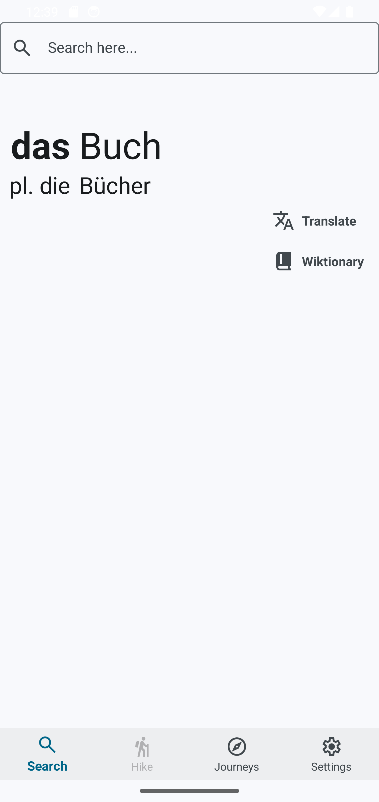
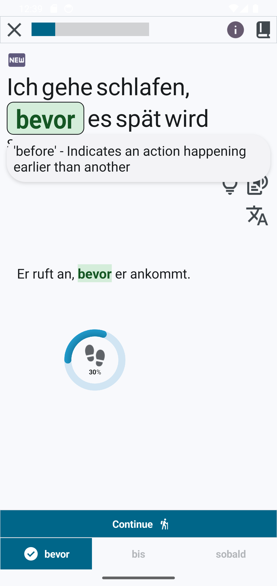
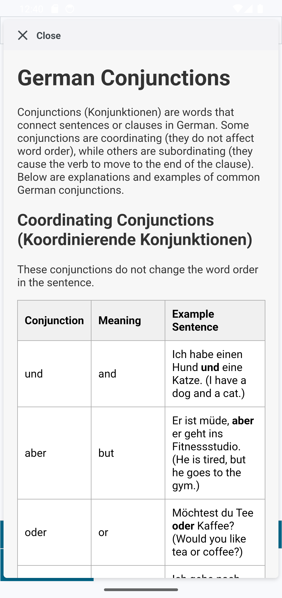
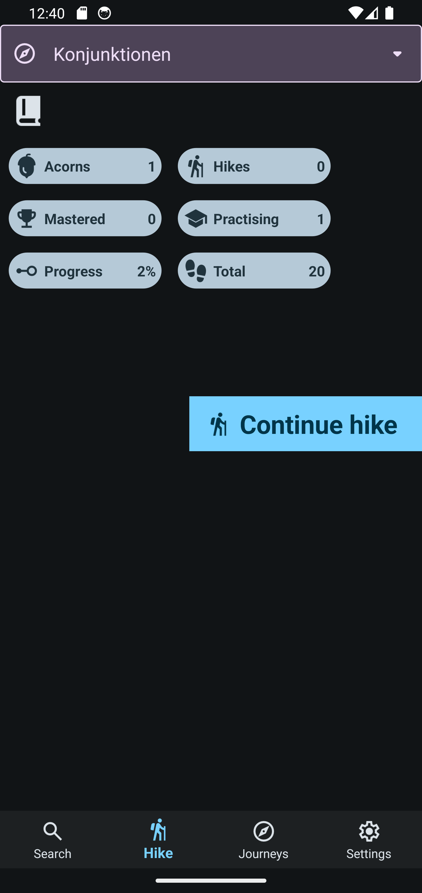
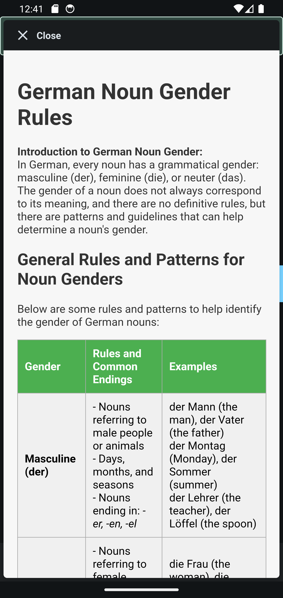

# Davio - German Grammar Learning App

https://play.google.com/store/apps/details?id=com.davio

## About Me

Hello there and a big warm welcome to Davio! I'm a German learning enthusiast and a .NET developer who recently moved to Germany from Sweden with my wife and our son. While I quickly learned enough German to 'get by,' I struggled with both easy and complex parts of German grammar. I found that grammar is crucial not only for reading and writing but also for everyday conversations but it's also essential for quickly understanding simple sentences and expressing oneself with confidence. Davio the squirrel is a combination of me and my wife's names and our son is a big fan of squirrels 😊

## Why I Created Davio

When I started improving my grammar skills, I couldn't find an app that met my needs. The learning apps I tried were either too simple and scattered or too boring and ineffective. So, with some spare time and a desire to learn mobile app development, I decided to create **Davio**.

Davio is designed to be fun, quick, and effective — helping users learn German grammar while enjoying the process. Though initially built for my own learning journey, I sincerely hope others can benefit and enjoy from it as well.

## Who is the App For?
- 🧑‍🎓 Beginners, intermediate and advanced learners who easily and quickly want to improve their German grammar.
- 📚 People looking for an engaging and effective way to improve grammar.
- 💻 Developers or enthusiasts interested in seeing a MAUI-based app in action.

## Features

- 📖 Interactive grammar lessons for key German grammar topics.
- 🔍 Quick Search Function – Quickly and easily find the correct gender for nouns and verb conjugations.
- 📝 Exercises tailored to improve both basic and advanced grammar skills.
- 📖 Each grammar lesson includes a longer example sentence and text-to-speech functionality.
- 📊 Progress tracking to monitor learning.
- 🖥️ Clean and modern UI with intuitive navigation.
- 🌍 Offline support for learning on the go.
- 🌗 Supports both light and dark mode as well as multiple color themes.

## Screenshots

## Video 📺

## Future Roadmap

I plan to continuously expand Davio with:

- ➕ New grammar topics and exercises. Specific German certificate A1->C1 tests
- 🎮 Improved gamification for learning.
- 🔊 More audio examples and hints.

## How to Contribute

Feel free to contribute by:

- 🐛 Reporting bugs or issues.
- 💡 Suggesting new features.
- ✨ Sharing feedback for improvements.

## Technologies Used

Davio is built with the following technologies:

- 🌐 **.NET MAUI** - [Learn More](https://learn.microsoft.com/en-us/dotnet/maui/)
  - Multi-platform framework for building native applications.
- 🛠️ **Community Toolkit** - [Learn More](https://learn.microsoft.com/en-us/dotnet/communitytoolkit/)
  - Extends the functionality of MAUI with additional controls and features.
- 🎨 **DevExpress** - [Learn More](https://www.devexpress.com/maui/)
  - A set of powerful UI components for creating modern user interfaces.
- ✍️ **MAUI C# Markup** - [Learn More](https://learn.microsoft.com/en-us/dotnet/communitytoolkit/maui/markup/markup)
  - Enables declarative UI design using C# instead of XAML.

## Powered by AI 🤖
This project also benefited from AI tools, including [ChatGPT](https://openai.com/chatgpt) for drafting and refining ideas and generating images.

## Get in Touch

If you have questions or feedback, feel free to reach out via:

- 📧 **Email**: [heimchencoders@gmail.com](mailto:heimchencoders@gmail.com)
- 📝 **GitHub Issues**: [Open an Issue](https://github.com/David-Ernstsson/DavioGrammarQuestPublic/issues)

---
**Davio** - Learn German Grammar the Easy and Effective Way!

